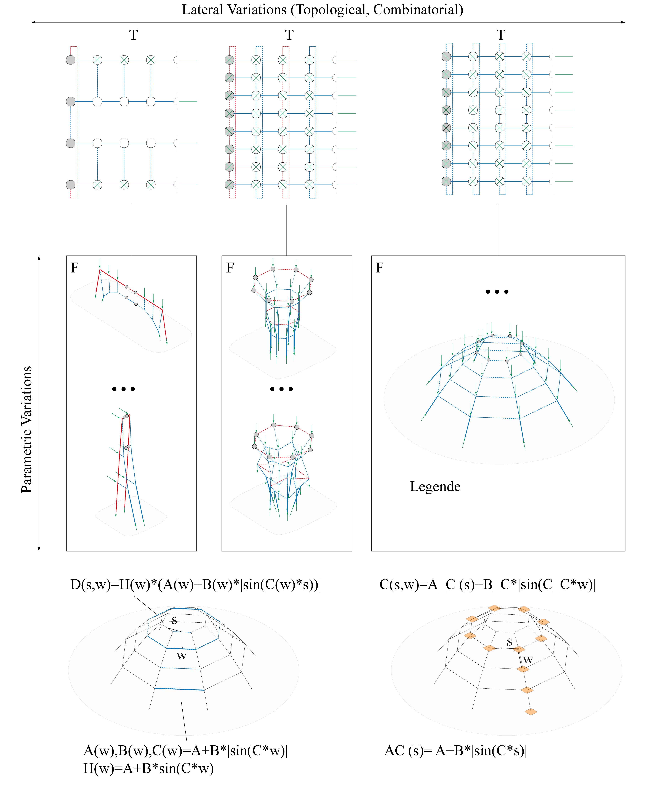
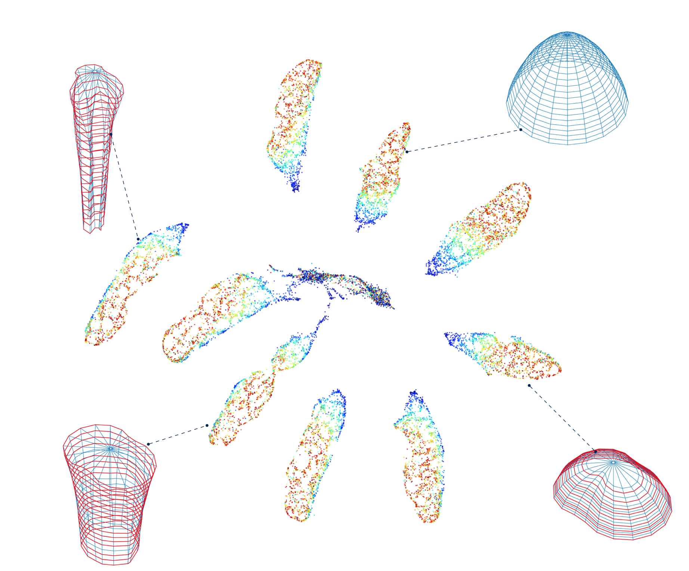
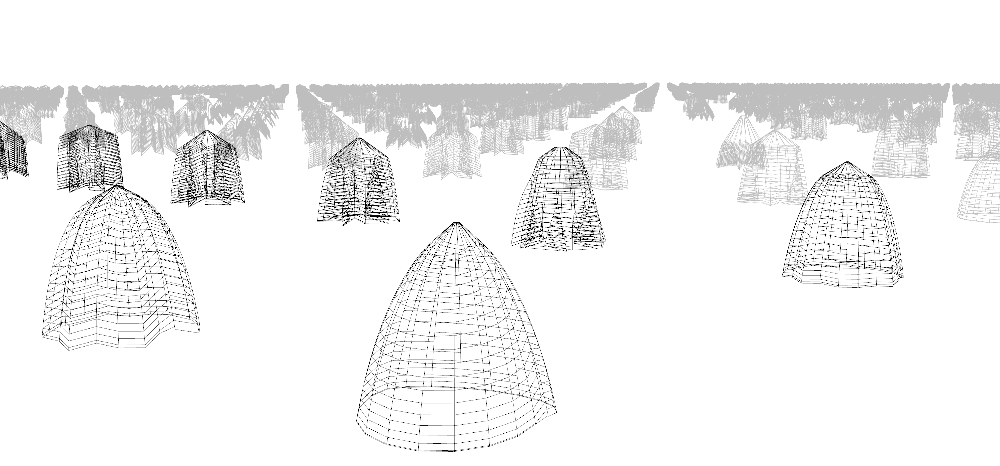

# Data-Driven Design: Exploring new Structural Forms using Machine Learning and Graphic Statics

## Project Team
* [Lukas Fuhrimann](https://www.researchgate.net/profile/Lukas_Fuhrimann)
* [Vahid Moosavi](https://vahidmoosavi.com/)
* [Patrick Ole Ohlbrock](http://www.schwartz.arch.ethz.ch/Team/patrickoleohlbrock.php?lan=en)
* [Pierluigi D’acunto](http://www.schwartz.arch.ethz.ch/Team/pierluigidacunto.php?lan=en)

### This ongoing project is a collaboration between Chair for Computer Aided Architectural Design [CAAD](http://www.caad.arch.ethz.ch/) and Chair of [Structural Design](http://www.schwartz.arch.ethz.ch/?lan=en) at ETH Zurich.

# Summary (From the paper)
The aim of this research is to introduce a novel structural design process that allows architects and engineers to extend their typical design space horizon and thereby promoting the idea of creativity in structural design. The theoretical base of this work builds on the combination of structural form-finding and state-of-the-art machine learning algorithms. In the first step of the process, Combinatorial Equilibrium Modelling (CEM) is used to generate a large variety of spatial networks in equilibrium for given input parameters. In the second step, these networks are clustered and represented in a form-map through the implementation of a Self Organizing Map (SOM) algorithm. In the third step, the solution space is interpreted with the help of a Uniform Manifold Approximation and Projection algorithm (UMAP). This allows gaining important insights in the structure of the solution space. A specific case study is used to illustrate how the infinite equilibrium states of a given topology can be defined and represented by clusters. Furthermore, three classes, related to the non-linear interaction between the input parameters and the form space, are verified and a statement about the entire manifold of the solution space of the case study is made. To conclude, this work presents an innovative approach on how the manifold of a solution space can be grasped with a minimum amount of data and how to operate within the manifold in order to increase the diversity of solutions.

### [Codes](https://github.com/sevamoo/Structural_Form_Machine_Learning/tree/master/Codes) 

* **[Main library for form generation](https://github.com/OleOhlbrock/CEM)**

### [Paper](https://github.com/sevamoo/Structural_Form_Machine_Learning/blob/master/IASS%20paper.pdf)

### [Master Thesis](https://github.com/sevamoo/Structural_Form_Machine_Learning/blob/master/Master%20thesis_small_size.pdf)

### [Data](https://polybox.ethz.ch/index.php/s/Wqktm9aKzT8jYsh)

